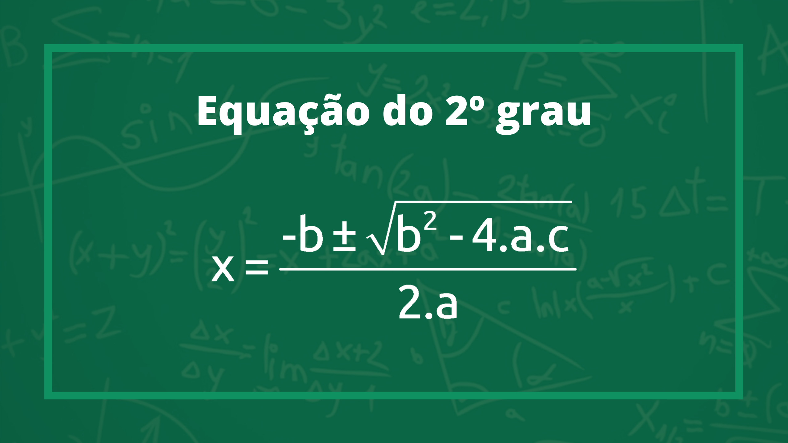
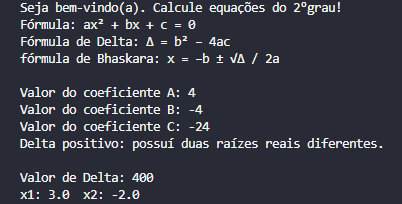
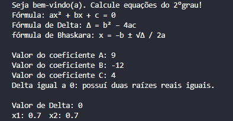

# Equação do 2º Grau com Python

### Projeto pessoal criado para desenvolvimento escolar.

🐍 Técnica Utilizada:
* Lógica de Programação em Python, para resolução de problemas.

---
🔨 Funcionalidades:
* Obter os coeficientes A, B e C informados pelo usúario;
* Encontrar o valor de Delta através da Fórmula de Delta;
* Resolver a Fórmula de Bhaskara e retornar os valores de x1 e x2.
---

📂 Acesse o Projeto:
* Você pode conhecer o código fonte incial do projeto [clique aqui](https://github.com/ericktechx/quadratic-equation). 
Ou baixá-lo através do git:

        git clone https://github.com/ericktechx/quadratic-equation

🚨Observações:
* Certifique-se de ter python3 e git instalado em seu computador;
* Caso faça download .zip ou tar.gz será necessário o processo de
extrair arquivos.

---
🛠 Como usar:

        # Run in Windows
        > python quadratic_equation.py

        # Run in Linux, Termux and Mac
        $ python3 quadratic_equation.py
---
👁‍🗨 Exemplos:

Imagem 1

Imagem 2

